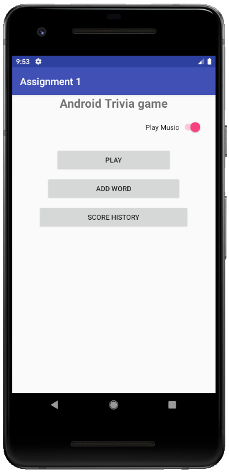
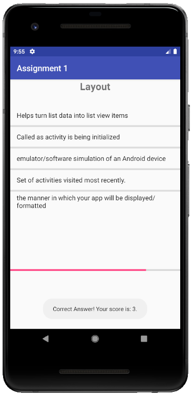
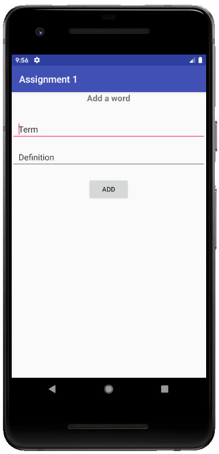
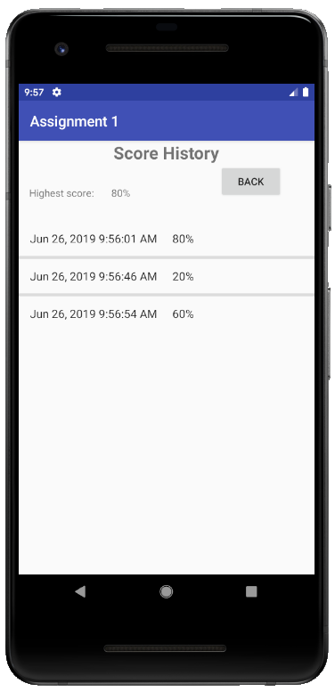

# Assignment 1
The primary goal of this project was to build our first Android app. 

## Overview

  

The application is a basic trivia game. It has three main activities:
1. [PlayActivity.java](#play)
2. [AddWordActivity.java](#add-word)
3. [ScoreActivity.java](#score-history)

## Play
The user plays the game by answering 5 trivia vocabulary questions. As the questions are answered, the progress bar fills out appropriately. If the answer is correct, the user's score increases by 1.

  

## Add Word
The user has the capability to add a word to the vocab database. They can add a term and definition, and it will add right into the list of vocab words.

  

## Score History
After each game, the user's score history is stored with a timestamp and total score.

  

