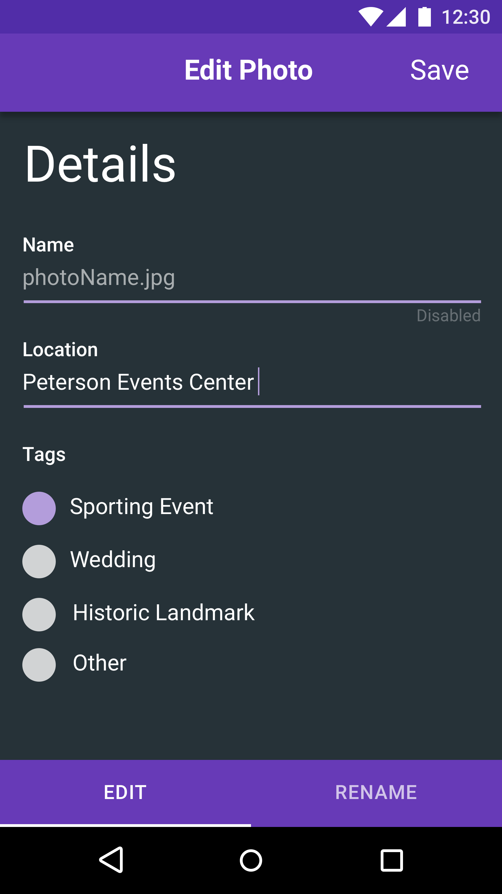

# Photo-Editor

## Overview

<table>
  <tr>
    <th>
      
    </th>
    <th>
      
    </th>
    <th>
      
    </th>
    <th>
      
    </th>
  </tr>
</table>

## MAIN HEX COLORS
* #673AB7 - Purple **(toolbar)**
* #263238 - Dark Gray **(background)**
* #000000 - Black @ 45% opacity **(pressed button)**
* #E0E0E0 - Gray **(unselected button)**
* #B39DDB - Light Purple **(EditText bottom line)**

## Members
* Sai Konduru
* Allen Poon 
* Kevin Klute
* Collin Dreher 
* Justin Keenan 

## Google account credentials
* u: group10.cs1699@gmail.com
* p: !PhotoEditor1
