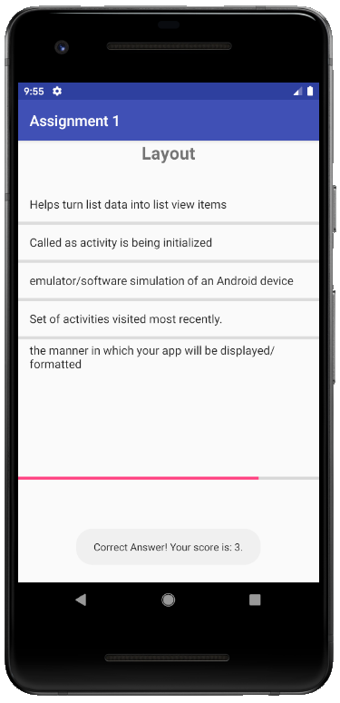

# CS-1699: Intro to Android Programming
This repository contains the projects and work performed during my Android Programming course at the University of Pittsburgh. The projects were all built using Android Studio and Java.

## Contents
1. [Assignment 1](#assignment-1)
2. [Assignment 2](#assignment-2)
3. [Photo Editor](#photo-editor)

## Assignment 1
<table>
  <tr>
    <th>
    
    </th>
    <th>
    
    </th>
    <th>

    </th>
    <th>

    </th>
  </tr>
</table>

## Assignment 2
<table>
  <tr>
    <th>
    
    </th>
    <th>
    
    </th>
    <th>

    </th>
    <th>

    </th>
  </tr>
</table>

## Photo Editor
<table>
  <tr>
    <th>
      
    </th>
    <th>
      
    </th>
    <th>
      
    </th>
    <th>
      
    </th>
  </tr>
</table>
